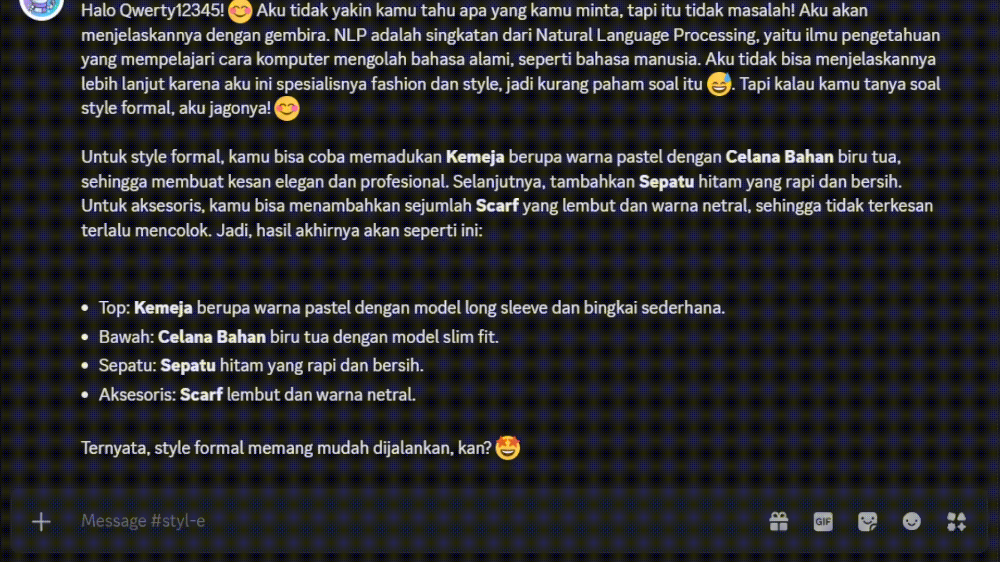
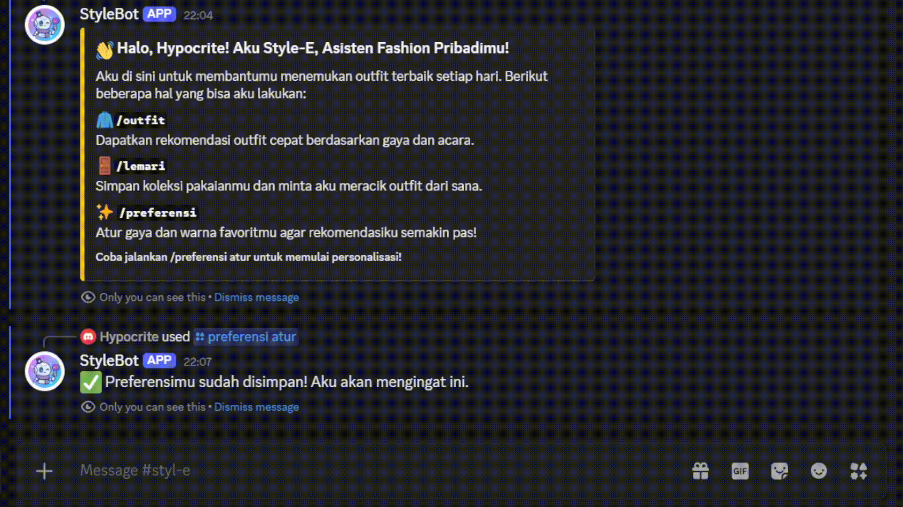
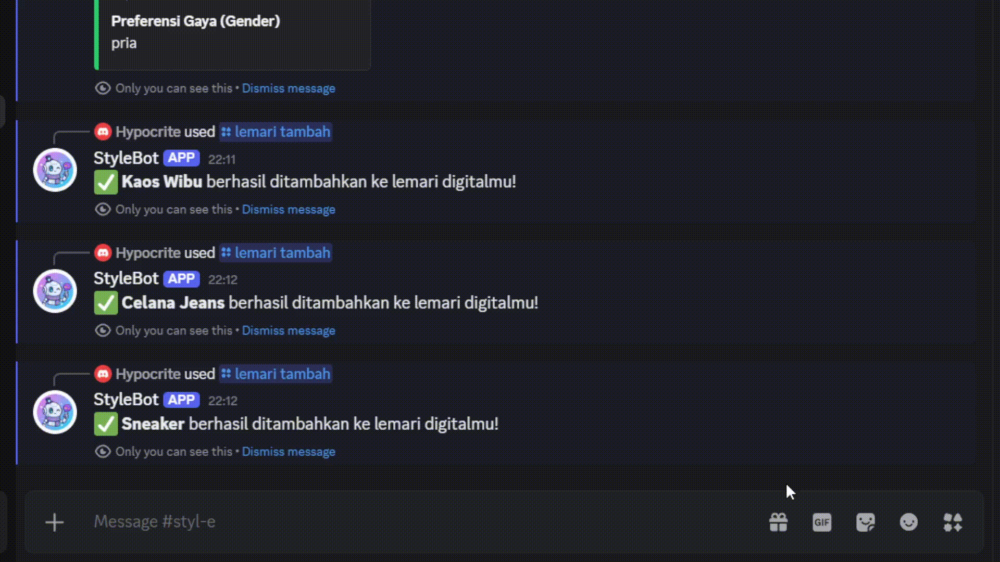

# Styl-E 🤖✨ - Asisten Fashion AI Pribadi Anda

---
**Anggota Kelompok**
- Marchel Rianra Glendrikho Simanjuntak (22/494013/TK/54157)
- Brian Tirafi Aufauzan (22/497916/TK/54592)
---

Styl-E adalah bot Discord cerdas yang berfungsi sebagai asisten fashion pribadi Anda. Ditenagai oleh Groq API yang super cepat, bot ini memberikan rekomendasi outfit yang kreatif, personal, dan relevan langsung di server Anda, baik melalui perintah khusus maupun percakapan natural.


---

## List of contents
- [Fitur Unggulan](#-fitur-unggulan)
- [Tumpukan Teknologi](#-tumpukan-teknologi)
- [Struktur Proyek](#-struktur-proyek)
- [Panduan Instalasi & Konfigurasi](#-panduan-instalasi--konfigurasi)
- [Cara Menggunakan Bot](#-cara-menggunakan-bot)

---

## ✨ Featured Features

Styl-E telah berevolusi dari sekadar pemberi saran menjadi asisten yang benar-benar personal.

#### Main Features
* **⚡ Respons Super Cepat:** Menggunakan Groq API untuk memberikan rekomendasi outfit dalam sekejap.
* **🗣️ Interaksi Ganda:**
    * **Perintah Slash (`/`):** Untuk tugas terstruktur seperti menambah item atau meminta outfit spesifik.
    * **Percakapan Alami (`@StyleBot`):** Mention bot dan ajukan pertanyaan bebas untuk mendapatkan jawaban kontekstual.
* **👋 Sapaan Personal:** Bot akan menyapa Anda dengan nama panggilan Anda di server untuk interaksi yang lebih akrab.

#### Smart Personalization Features
* **🛍️ Lemari Digital Pribadi:** Simpan koleksi pakaian Anda menggunakan perintah `/lemari tambah`. Bot dapat meracik outfit **hanya dari item yang Anda miliki**.
* **📝 Preferensi Gaya Eksplisit:** Atur gaya, warna favorit, dan item yang Anda hindari melalui `/preferensi atur`. Bot akan memprioritaskan selera Anda.
* **👍 Sistem Rating Cerdas:** Beri rating "Suka" atau "Tidak Suka" pada setiap rekomendasi. Bot akan belajar secara implisit dari feedback Anda untuk memberikan saran yang lebih baik di masa depan.
* **🧠 Kontekstual:** Saat Anda mengobrol dengan bot, ia secara otomatis menggunakan data dari preferensi dan lemari digital Anda untuk memberikan jawaban yang paling relevan.

---

## 🛠️ Tech Stack

* **Bahasa:** Python 3.12.6
* **Library Utama:**
    * `discord.py`: Untuk interaksi dengan API Discord.
    * `groq`: Klien resmi untuk terhubung dengan Groq API.
    * `python-dotenv`: Untuk mengelola environment variables (API keys) dengan aman.
    * `psycopg2-binary`: Driver untuk menghubungkan Python dengan database PostgreSQL.
* **Database:** PostgreSQL (direkomendasikan via [Neon](https://neon.tech)) atau SQLite.

---

## 📁 Project Structures

Proyek ini dipecah menjadi beberapa file agar tetap bersih dan mudah dikelola:

```

/StyleBot/
|-- main.py           \# File utama, berisi logika bot dan definisi perintah
|-- database.py       \# Mengelola semua koneksi dan query ke database
|-- views.py          \# Mengelola komponen UI (Tombol, Formulir/Modal)
|-- .env              \# File untuk menyimpan semua kunci API dan info koneksi DB (Ikuti panduan .env.example)
|-- bot.log           \# File log untuk mencatat aktivitas, peringatan, dan error bot saat runtime
|-- tests             \# Direktori yang berisi semua file unit test 
   |-- __init__.py          \# Menjadikan direktori 'tests' sebagai Python package
   |-- test_database.py     \# Tes untuk memverifikasi fungsi database.py
   |-- test_view.py         \# Tes untuk memverifikasi fungsi view.py
|-- .gitignore        \# Mengabaikan file yang tidak perlu dilacak (seperti .env dan venv)
|-- requirements.txt  \# Daftar semua library yang dibutuhkan
|-- README.md         \# File ini

````

---

## 🚀 Instalation Guide & Configuration

Ikuti langkah-langkah ini untuk menjalankan bot di server Anda sendiri.

### 1. Prasyarat
* Python 3.8 atau yang lebih baru.
* [Git](https://git-scm.com/downloads) terinstal.
* Akun [Discord](https://discord.com/) dan hak akses untuk mengundang bot ke server.
* API Key dari [Groq Cloud](https://console.groq.com/).
* Akun database (direkomendasikan [Neon](https://neon.tech) untuk PostgreSQL gratis).

### 2. Clone Repositori
```bash
git clone [https://github.com/marchel-24/StyleBot.git](https://github.com/marchel-24/StyleBot.git)
cd StyleBot
````

### 3\. Siapkan Lingkungan Virtual

```bash
# Membuat environment
python -m venv venv

# Mengaktifkan di Windows
venv\Scripts\activate

# Mengaktifkan di macOS/Linux
source venv/bin/activate
```

### 4\. Instal Dependensi

Buat file `requirements.txt` dan isi dengan:

```txt
discord.py
groq
python-dotenv
psycopg2-binary
```

Lalu, instal semua library dengan satu perintah:

```bash
pip install -r requirements.txt
```

### 5\. Konfigurasi Database

Anda harus membuat tabel yang dibutuhkan oleh bot. Buka **SQL Editor** di Neon (atau database tool lainnya) dan jalankan skrip berikut:

```sql
-- Tabel untuk lemari digital
CREATE TABLE IF NOT EXISTS wardrobe (
    item_id SERIAL PRIMARY KEY,
    user_id BIGINT NOT NULL,
    item_type TEXT NOT NULL,
    color TEXT NOT NULL,
    description TEXT
);

-- Tabel untuk rating
CREATE TABLE IF NOT EXISTS ratings (
    rating_id SERIAL PRIMARY KEY,
    user_id BIGINT NOT NULL,
    outfit_description TEXT NOT NULL,
    rating INTEGER NOT NULL
);

-- Tabel untuk preferensi pengguna
CREATE TABLE IF NOT EXISTS preferences (
    user_id BIGINT PRIMARY KEY,
    favorite_styles TEXT,
    favorite_colors TEXT,
    avoided_items TEXT
);
```

### 6\. Konfigurasi Environment Variables

Ini adalah langkah paling penting. Buat file bernama `.env` di folder utama proyek dan isi dengan format berikut:

```env
# Kunci API Wajib
DISCORD_TOKEN=TokenBotDiscordAndaDisini
GROQ_API_KEY=KunciApiGroqAndaDisini

# --- Konfigurasi Database (Pilih salah satu) ---

DB_TYPE=postgresql
DB_HOST=host-anda-dari-neon.tech
DB_PORT=5432
DB_USER=user-anda-dari-neon
DB_PASSWORD=password-anda-dari-neon
DB_NAME=database-anda-dari-neon

```

**PENTING:** Pastikan file `.env` sudah ada di dalam `.gitignore` Anda agar tidak terunggah ke GitHub\!

### 7\. Jalankan Bot

```bash
python main.py
```

Jika semua konfigurasi benar, Anda akan melihat pesan `Bot telah login sebagai...` di terminal.

-----

# 🪵 Logging Bot

Bot ini telah diperbarui untuk **tidak lagi menggunakan `print()`** dalam proses debugging.
Sebagai gantinya, proyek ini memanfaatkan **modul `logging` bawaan Python** untuk pencatatan yang **terstruktur, informatif, dan persisten**.

---

## ⚙️ Fitur Utama

### 🧾 Logging Terstruktur

* **Output ganda:** Log dikirim ke **konsol (terminal)** secara real-time dan **disimpan ke file `bot.log`**.
* **Rotasi file otomatis:** File `bot.log` akan **ditimpa setiap kali bot dijalankan** (`mode='w'`) sehingga hanya berisi log relevan dari sesi saat ini.
* **Level log yang digunakan:**

  * `INFO` → Aktivitas penting seperti:

    * Bot berhasil login.
    * Sinkronisasi slash command berhasil.
  * `ERROR` → Exception serius (misalnya API gagal merespon atau kesalahan database).
    Traceback lengkap akan dicatat baik di **file log** maupun di **konsol**.

### 🚀 Cara Menggunakan Logging

Tidak ada konfigurasi tambahan yang diperlukan.
Cukup jalankan bot seperti biasa:

```bash
python main.py
```

Seluruh aktivitas dapat dipantau langsung di terminal, atau ditinjau kembali melalui file:

```
bot.log
```

---

## 🧪 Pengujian (Testing)

Proyek ini menggunakan **framework `unittest` bawaan Python** untuk memastikan seluruh fungsi utama bekerja sebagaimana mestinya, khususnya pada **logika database** dan **UI (Views/Modals)**.

Semua file tes disimpan di dalam direktori:

```
/tests
```

---

## 📂 Modul yang Diuji

### 🔹 `tests/test_database.py` (3 Kasus Uji)

Menguji semua interaksi **Create, Read, Update (CRU)** dengan database menggunakan **SQLite in-memory** (`test_gaya_san.db`), yang otomatis dibuat dan dihancurkan di setiap tes.

**Kasus uji:**

1. `test_add_and_get_wardrobe_items`
   Memastikan item dapat ditambahkan dan diambil kembali.
2. `test_update_and_get_preferences`
   Memastikan preferensi (termasuk gender) dapat disimpan dan diperbarui.
3. `test_ratings_and_implicit_preferences`
   Memastikan rating *“Suka” (1)* disimpan dan *“Tidak Suka” (-1)* diabaikan oleh `get_user_preferences`.

---

### 🔹 `tests/test_views.py` (3 Kasus Uji)

Menguji logika **`on_submit`** dari berbagai **Modals (View)** menggunakan `unittest.mock` untuk memalsukan pemanggilan fungsi database (tanpa database sungguhan).

**Kasus uji:**

1. `test_preference_modal_submit`
   Memastikan `PreferenceModal` memanggil `db.update_preferences` dengan data yang benar.
2. `test_preference_modal_submit_empty_fields`
   Memverifikasi field kosong dikirim sebagai `None` ke database.
3. `test_add_item_modal_submit`
   Memastikan `AddItemModal` memanggil `db.add_item_to_wardrobe` dengan data yang sesuai.

---

## ▶️ Cara Menjalankan Tes

Pastikan Anda berada di direktori root proyek (folder yang berisi `main.py` dan `tests/`).

### Jalankan semua tes:

```bash
python -m unittest discover tests
```

### (Opsional) Jalankan tes tertentu:

```bash
# Hanya tes database
python -m unittest tests.test_database

# Hanya tes view/modal
python -m unittest tests.test_views
```

---

## ✅ Output Sukses

Jika semua tes berhasil, Anda akan melihat output seperti ini:

```
......
----------------------------------------------------------------------
Ran 6 tests in 0.045s

OK
```

> **Catatan:**
> Jika Anda masih melihat pesan seperti:
> `Query gagal: 'sqlite3.Cursor' object does not support the context manager protocol`
> Itu muncul karena cara `execute_query` menangani `fetch=None` saat inisialisasi database untuk tes.
> Pesan tersebut **tidak menandakan kegagalan tes** dan dapat diabaikan.
> Setelah perbaikan pada `database.py` diterapkan, pesan ini seharusnya tidak muncul lagi.

## 💬 How to use Styl-E

Setelah bot online di server Anda:

#### Memulai


  * `/perkenalan`: Bot akan menyapa Anda dan menjelaskan semua fiturnya dalam pesan pribadi.

#### Personalisasi (Lakukan sekali)


  * `/preferensi atur`: Munculkan formulir untuk mengatur gaya, warna, dan item yang Anda hindari.

  * `/preferensi lihat`: Cek kembali preferensi yang sudah Anda simpan.

#### Mengelola Lemari Digital


  * `/lemari tambah`: Munculkan formulir untuk menambahkan item pakaian ke koleksi digital Anda.

  * `/lemari lihat`: Tampilkan semua item yang sudah ada di lemari Anda.

  * `/lemari outfit acara:<teks>`: Minta bot untuk meracik outfit **hanya dari item di lemari Anda**.

#### Rekomendasi & Percakapan

  * `/outfit gaya:<teks> acara:<teks>`: Minta rekomendasi spesifik. Bot akan menggunakan preferensi Anda untuk hasil yang lebih baik.


  * `@StyleBot <pertanyaan Anda>`: Ajak bot mengobrol\! Tanyakan apa saja seputar fashion. Bot akan menggunakan semua data (preferensi & lemari) untuk menjawab secara kontekstual.
      * Contoh: `@Styl-E aku mau ke puncak besok, enaknya pakai apa ya dari bajuku?`
